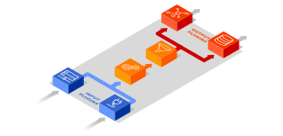

IPFIXcol2
===========

IPFIXcol2 is a flexible, high-performance NetFlow v5/v9 and IPFIX flow data collector designed
to be extensible by plugins. The second generation of the collector includes many design and
performance enhancements compared to the original `IPFIXcol <https://github.com/CESNET/ipfixcol/>`_.

The collector allows you to choose combination of input, intermediate and output plugins that
best suit your needs. Do you need to receive data over UDP/TCP and store them for long term
preservation? Or, do you prefer conversion to JSON and processing by other systems?
No problem, pick any combination of plugins.

*Features:*

- Input, intermediate and output plugins with various options
- Parallelized design for high-performance
- Support for bidirectional flows (biflow)
- Built-in support for many Enterprise-Specific Information Elements (Cisco, Netscaler, etc.)

Available plugins
-----------------

**Input plugins** - receive IPFIX data. Each can be configured to to listen on a specific
network interface and a port. Multiple instances of these plugins can run concurrently.

- `UDP <src/plugins/input/udp>`_ - receives NetFlow v5/v9 and IPFIX over UDP
- `TCP <src/plugins/input/tcp>`_ - receives IPFIX over TCP

**Intermediate plugins** - modify, enrich and filter flow records.

- `anonymization <src/plugins/intermediate/anonymization/>`_ - anonymize IP addresses
  (in flow records) with Crypto-PAn algorithm

**Output plugins** - store or forward your flows.

- `FDS file <src/plugins/output/fds>`_ - store all flows in FDS file format (efficient long-term storage)
- `JSON <src/plugins/output/json>`_ - convert flow records to JSON and send/store them
- `Viewer <src/plugins/output/viewer>`_ - convert IPFIX into plain text and print
  it on standard output
- `IPFIX file <src/plugins/output/ipfix>`_ - store all flows in IPFIX File format
- `Time Check <src/plugins/output/timecheck>`_ - flow timestamp check
- `Dummy <src/plugins/output/dummy>`_ - simple module example
- `lnfstore <extra_plugins/output/lnfstore>`_ (*) - store all flows in nfdump compatible
  format for long-term preservation
- `UniRec <extra_plugins/output/unirec>`_ (*)  - send flow records in UniRec format
  via TRAP communication interface (into Nemea modules)

\* Must be installed individually due to extra dependencies

How to build
------------

IPFIXcol is based on `libfds <https://github.com/CESNET/libfds/>`_ library that provides
functions for IPFIX parsing and manipulation. First of all, install the library.
For more information visit the project website and follow installation instructions.

However, you have to typically do following steps: (extra dependencies may be required)

.. code-block:: bash

    $ git clone https://github.com/CESNET/libfds.git
    $ cd libfds
    $ mkdir build && cd build && cmake .. -DCMAKE_INSTALL_PREFIX=/usr
    $ make
    # make install

Second, install build dependencies of the collector

**RHEL/CentOS:**

.. code-block::

    yum install gcc gcc-c++ cmake make python-docutils zlib-devel
    # Optionally: doxygen pkg-config

* Note: latest systems (e.g. Fedora) use ``dnf`` instead of ``yum``.
* Note: package ``python-docutils`` may by also named as ``python2-docutils`` or ``python3-docutils``
* Note: package ``pkg-config`` may by also named as ``pkgconfig``

**Debian/Ubuntu:**

.. code-block::

    apt-get install gcc g++ cmake make python3-docutils zlib1g-dev
    # Optionally: doxygen pkg-config

Finally, build and install the collector:

.. code-block:: bash

    $ mkdir build && cd build && cmake ..
    $ make
    # make install

How to configure and start IPFIXcol
-----------------------------------

Before you can start IPFIXcol, you have to prepare a configuration file. The file describes how
IPFIXcol is configured at startup, which plugins are used and, for example, where flow data will
be stored. The structure of the configuration is described
`here <doc/sphinx/configuration.rst>`_. Several configuration examples that demonstrate features
of the collector are given in the section
"`Example configuration files <doc/sphinx/configuration.rst#example-configuration-files>`_".

Coming soon
-----------
- Runtime reconfiguration (improved compared to the previous generation)
- Flow filtration and flow profiling
- RPM/DEB packages

FAQ
--------------

Do you have any troubles? Unable to build and run the collector? *Feel free to submit a new issue.*

We are open to new ideas! For example, are you missing a specific plugin that could
be useful also for other users? Please, share your experiences and thoughts.

----

:Q: My exporter sends flow data over UDP, however, the IPFIXcol doesn't process/store any data
    immediately after start.
:A: This is normal behaviour caused by UDP transport protocol. It may take up few minutes until
    the first record is processed based on template refresh interval on the exporter.
    For more information, see documentation of `UDP <src/plugins/input/udp>`_ plugin.

:Q: How can I add more IPFIX fields into records?
:A: The collector receives flow records captured and prepared by an exporter. IPFIX is an
    unidirectional protocol which means that the collector is not able to instruct the exporter
    what to measure or how to behave. If you want to enhance your records, please, check
    configuration of your exporter.

:Q: After *manual build and installation* the collector is unable to start and a message similar to
    ``error while loading shared libraries: libfds.so.0: cannot open shared object file: No such file or directory``
    is given.
:A: Make sure that ``libfds`` is installed properly and your system is able to locate it.
    Some systems (e.g. RHEL/CentOS/Fedora) for historical reason doesn't search for shared libraries
    in the default installation directory where the ``libfds`` is installed. You can permanently
    include this directory. For example, if the library is located in ``/usr/local/lib64``, use
    as administrator "``echo "/usr/local/lib64" > /etc/ld.so.conf.d/local64.conf && ldconfig``"
    or temporarily change an environment variable
    "``export LD_LIBRARY_PATH=$LD_LIBRARY_PATH:/usr/local/lib64/``"

