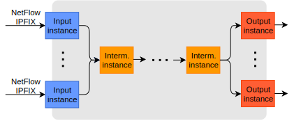

Collector configuration
=======================

IPFIXcol is designed to be easily extensible by input, intermediate and output plugins.
Therefore, the startup configuration of the collector consists of three parts, each for one type of
plugins, as illustrated below. The collector typically receives data from exporters and stores
them on local drive or forward them to another destination. Hence, every startup configuration
contains a description of at least one instance of an input plugin and one instance of an output
plugin. The intermediate section can be omitted if not required.

.. code-block:: xml

    <ipfixcol2>
        <inputPlugins>
            ...   <!-- one or more <input> -->
        </inputPlugins>

        <intermediatePlugins>
            ...   <!-- zero or more <intermediate> -->
        </intermediatePlugins>

        <outputPlugins>
            ...   <!-- one or more <output> -->
        </outputPlugins>
    </ipfixcol2>

A plugin documentation always provides a description of parameters and a configuration snippet
that can be easily copied into your configuration. However, keep in mind that some parameters
should be modified, for example, a storage directory of an output plugin, etc.

The fundamental objective of the collector is an emphasis on high performance. To reach this
goal, each instance is executed by its own thread. This makes possible to run simultaneously
multiple input, intermediate and output instances and at the same effectively use system resources.
Just like everywhere else your collector is as fast as the slowest instance in the configuration.

Even multiple instances of the same plugin can run concurrently. However, instances must have
slightly different configurations. For example, instances of output plugins should not write to
the same directory, instances of input plugins cannot listen on the same port and interface, etc.

Input plugins
-------------

The main purpose of the collector is to process flow data. To receive and process them,
input plugins are essential. Thus, one or more instances of input plugins must be defined within
``<inputPlugins>`` section. First, let's look at what is composed of:

.. code-block:: xml

    <input>
        <name>...</name>
        <plugin>...</plugin>
        <params>...</params>
    </input>

:``name``:
    User identification of the instance. Must be unique within the section.
:``plugin``:
    Internal identification of a plugin to whom the instance belongs. The identification
    is assigned by an author of the plugin.
:``params``:
    Configuration parameters of the instance. The parameters varies from plugin to plugin.
    For help, see documentation of individual plugins.

For example, this is how a configuration of `TCP <../../src/plugins/input/tcp>`_ input plugin
could look like:

.. code-block:: xml

    <input>
        <name>TCP collector</name>
        <plugin>tcp</plugin>
        <params>
            <localPort>4739</localPort>
            <localIPAddress></localIPAddress>
        </params>
    </input>

Intermediate plugins
--------------------

Now we have flow data inside the collector, but what if we want to modify or enrich them.
Intermediate plugins are here to help. On the other hand, if modifications are not
required, the whole section can be omitted. Thus, zero or more instances of intermediate
plugins can be defined inside ``<intermediatePlugins>`` section.

Although the order of input and output instances in a configuration doesn't matter, in case of
intermediate plugins, it is important because it represents order of flow processing inside
the internal data pipeline.

Let's look at what the definition of an intermediate instance is composed of:

.. code-block:: xml

    <intermediate>
        <name>...</name>
        <plugin>...</plugin>
        <params>...</params>
    </intermediate>

As you can see, the configuration structure is almost equivalent to the structure of
input instances. They differ only in the element name, but meaning of the parameters is still
the same.

Output plugins
--------------

Flow records are already prepared by input and intermediate plugins. The next step is to store them
on local drive or forward to another destination for further processing. For these reasons,
one or more instances of output plugins must be defined inside ``<outputPlugins>`` section.
Again, the structure of an instance definition looks pretty similar like before.

.. code-block:: xml

    <output>
        <name>...</name>
        <plugin>...</plugin>
        <params>...</params>
    </output>

By default, an instance processes all records that are received by input plugins. However, each
output instance also supports *optional* Observation Domain ID (ODID) filter.
What does it mean for you? Let's say you have multiple exporters monitoring your network.
These exporters typically allow you to set an ODID associated to exported flow records so
you can easily distinguish their origin. On the collector side, the ODID filter of an output
instance allows you to select a range of ODIDs that should be processed by the particular instance.
Flows from other sources are ignored.

How can you use it? One of many common use-cases is that if you want to store flow data
from different exporters to different output directories you can create multiple instances
of the same output plugin with similar configurations and different ODID filters.
Another use-case that is also worth mentioning is load-balancing. For example, when
flow conversion to JSON is not fast enough, you can try to split flows into multiple
groups based on their ODID and process each group by an independent instance of the plugin.

To enable the optional ODID filter, use one of the following parameter that takes a filter
expression as an argument:

:``<odidOnly>``:   Process flows only from the selected ODID range
:``<odidExcept>``: Process all flows except those from the selected ODID range

The filter expression is represented as comma separated list of unsigned numbers
and intervals. Interval is all the numbers between two given numbers separated by a dash.
If one number of the interval is missing, the minimum or the maximum is used by default.
For example, "1-5, 7, 10-" represents all ODIDs except 0, 6, 8 and 9

.. code-block:: xml

    <output>
        ...
        <odidOnly>...</odidOnly>
        <!-- or -->
        <odidExcept>...</odidExcept>
        ...
    </output>

See documentation of your exporters how to configure exported ODID. It is recommended that
ODIDs are unique per exporter. Note: In case of NetFlow devices, ODID is often referred as
"Source ID".

Example configuration files
---------------------------

In this section you can see various example configuration files that demonstrate possibilities
of IPFIXcol. Always keep in mind that you should modify a configuration to fit you needs.

:`udp2json <../data/configs/udp2json.xml>`_:
    Receive flow data over UDP, convert them into JSON and provide them as a server on local port.
:`udp2json-kafka <../data/configs/udp2json-kafka.xml>`_:
    Receive flow data over UDP, convert them into JSON and send them to Apache Kafka.
:`tcp2anon2json <../data/configs/tcp2anon2json.xml>`_:
    Receive  flow data over TCP, anonymize them and store in JSON format on a local drive.
:`tcpUdp2lnf <../data/configs/tcpUdp2lnf.xml>`_:
    Receive flow data simultaneously over TCP and UDP and store them on a local drive in
    a nfdump compatible format (multiple instances of input plugins).
:`odidFilter <../data/configs/odidFilter.xml>`_:
    Receive flow data over UDP and store flows from different ODIDs to different locations
    (multiple instances of the same output plugin).
:`multiOutput <../data/configs/multiOutput.xml>`_:
    Receive flow data over TCP and store them in a nfdump compatible format on a local drive
    and simultaneously send to a remote host as JSON.
:`tcp2unirec <../data/configs/tcp2unirec.xml>`_:
    Receive flow data over TCP, convert them into UniRec format and send via TCP TRAP
    communication interface (port 8000).

Try your configuration
----------------------

When your configuration is ready, start of the collector is the next step. It is quite
easy, just call:

.. code-block:: bash

    ipfixcol2 -c <config_file>

If all plugin instances are successfully initialized, no message on output are written and
the collector is running. Be default, only error messages are shown on output. It is recommended
increasing verbosity level to see also warning messages (parameter "``-v``") during the first start.

  Note: Receiving flow data from an exporter *over UDP transport
  protocol* may lead due to IPFIX protocol structure to a situation when the collector
  is unable to interpret data immediately after start.
  For more information, see documentation of `UDP <../../src/plugins/input/udp>`_ plugin.

We prepared a file with few anonymized IPFIX flows, so you can try your configurations,
even without running a flow exporter. Just download the `file <../data/ipfix/example_flows.ipfix>`_
and use ``ipfixsend2`` tool
(distributed and installed together with IPFIXcol). For example, to send flow records over UDP
protocol with real-time simulation use:

.. code-block:: bash

    ipfixsend2 -d 127.0.0.1 -p 4739 -t UDP -i <ipfix_file> -n 1 -R 1.0

where:

================    =================================================
``-d 127.0.0.1``    Destination IP address of the collector
``-p 4739``         Destination port
``-t UDP``          Transmission protocol (supported types: UDP/TCP)
``-i <file>``       Input file with IPFIX Messages
``-n 1``            How many times the file should be send
``-R 1.0``          Real-time sending mode (speed 1.0x)
================    =================================================

When all records are sent, the ``ipfixsend2`` terminates. In this case, the problem with UDP
does not apply because the tool sends templates immediately after the start.

Optionally, you can save the configuration file to the default path where IPFIXcol
expects it. In that case, you can always run collector without specifying the file as a parameter.
The default path can be obtained from help of the collector, see ``ipfixcol2 -h``

Verbosity levels
----------------

If you run IPFIXcol without changing a verbosity configuration, only error messages are shown
on output. By default, all instances inherits verbosity level from the collector settings.
Therefore, increasing verbosity of the collector, e.g. "``ipfixcol2 -v``", also increase verbosity
level of all plugin instances.

Sometimes it is quite useful to increase verbosity level of only certain instances or hide
its messages on the console output. To achieve this, it is possible to overwrite verbosity level
of individual instances using optional parameter ``<verbosity>`` supported by all types
of instances. In that case, the selected level is used regardless of the global collector
settings.

For example, to overwrite verbosity level of an output instance just add the new parameter as
shown below. The same approach applies to other types of instances too.

.. code-block:: xml

    <output>
        ...
        <verbosity>debug</verbosity>
        ...
    </output>

Available verbosity levels:

=========== =========================================================================================
Verbosity   Description
=========== =========================================================================================
``none``    Hide all messages
``error``   Show only error messages (i.e. something went really wrong)
``warning`` Show error and warning messages (i.e. something is not right, but an action can continue)
``info``    Show all previous types of messages and informational (status) messages
``debug``   Show all types of messages (i.e. include messages interesting only for developers)
=========== =========================================================================================
